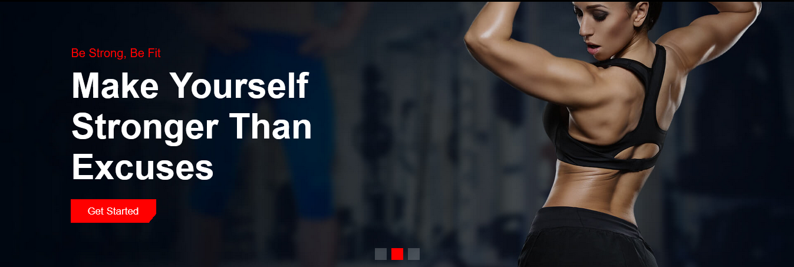
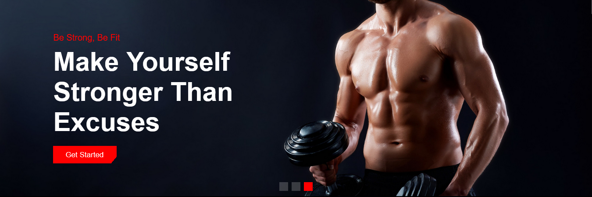
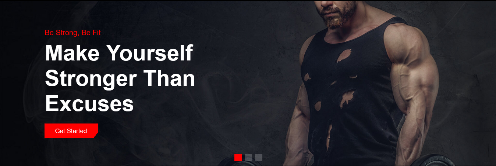
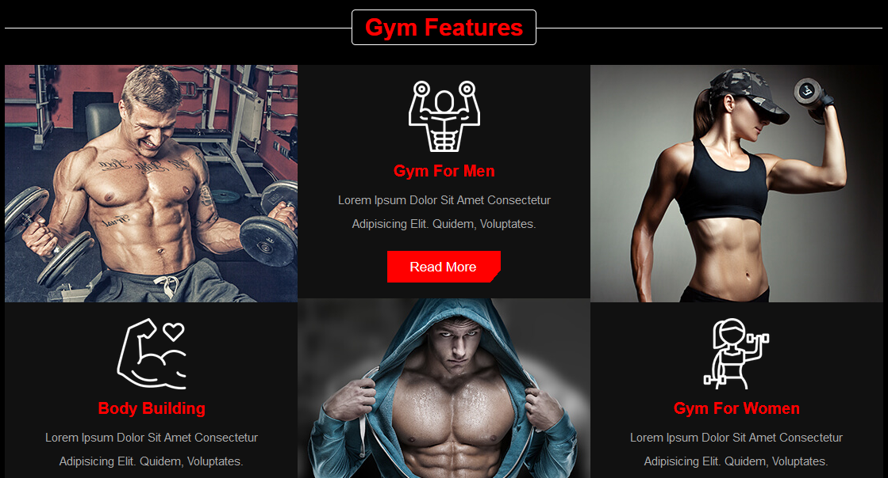
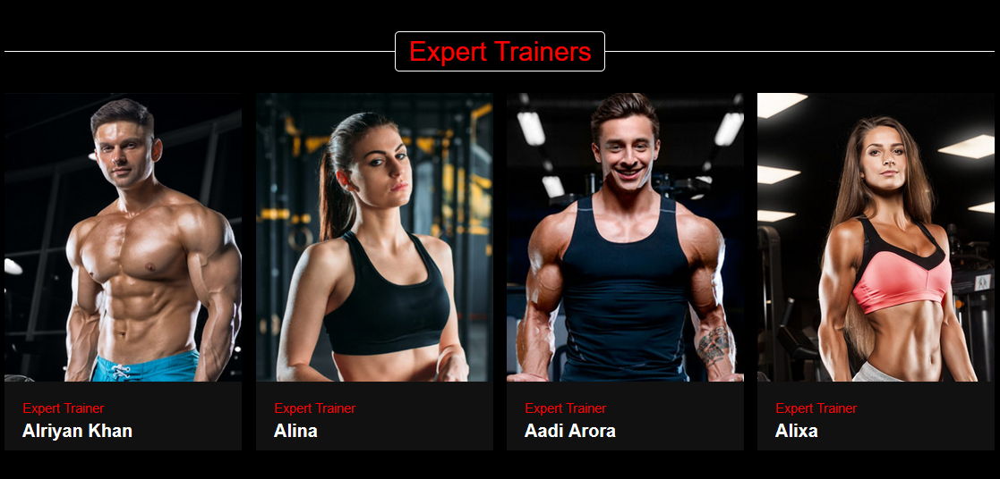
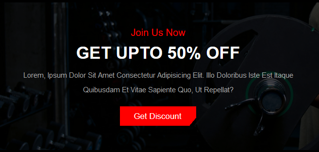
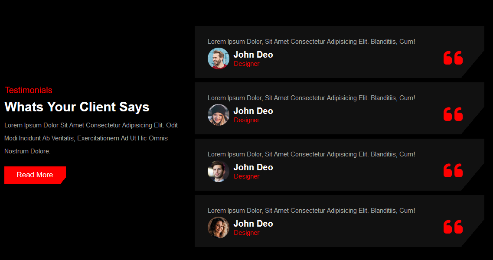
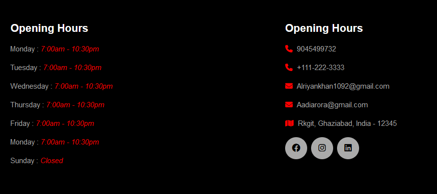

# Fiksheid-website
 <h1>Home</h1>
    
Its contain all the main information about the website.

    
Its also parted into sections. And each section contain the followings :-

    <ul>
        <li>Header/Navigation</li>
        <li>Sweaper Slides</li>
        <li>About Fitness</li>
        <li>Gym Features</li>
        <li>Pricing Plan</li>
        <li>Expert Trainers</li>
        <li>Discount Section</li>
        <li>Testamonials</li>
        <li>Footer Section</li>
    </ul>
    

    

    <h4>Header/Navigation</h4>
    
-It contain other page's link of the website.

    
    <ul>
        <li>About</li>
        <li>Features</li>
        <li>Trainers</li>
        <li>Contact Us</li>
        <li>Subscribtion</li>
    </ul>
    

    <h4>Sweaper Slides</h4>
    
-It contain three slides that get swapt with each other one after one.

    
-It also contain the <b>Get Started</b> butten .After clicking on it, the subscribtoin page will open.

    
followings are slides:-

    
    
    
    

    <h4>About fitness</h4>
    
-Fitness is the important part of out life. If we are fit we feel confident, motivated, mentally relaxed and many
        more.

    
-There are some points we should keep in mind while we are training :-

    <ul>
        <li>Mind And Body</li>
        <li>Healthy Life</li>
        <li>Strategies</li>
        <li>Workout</li>
    </ul>
    
    

    <h4>Gym Features</h4>
    
-This section contain as the name suggest " <b>features of gym</b> ".

    
-There are some features a gym should have :-

    <ul>
        <li>Range of high end fitness equipment</li>
        <li>Dedicated weight area</li>
        <li>Good environment</li>
        <li>Support online payment</li>
    </ul>
    
    
    

    <h4>Pricing plan</h4>
    
-It contain subscribtion cost of the gym.

    
    

    <h4>Trainers</h4>
    
-This section involve the information about the <b>Trainers</b>.

    
-Here we divide a section into 4 parts to display their photo and name . And as you move a cursor over a photo,
        the link of traine's social media handle will appear.

    
    

    <h4>Discount Section</h4>
    
-We put this section for special occasion. So that the owner can give on some festivals or special occasions

    
    

    <h4>Testamonials</h4>
    
-Here put review the review that we get from our user.

    
-You can think it as feedback section.

    
    

    <h4>Footer Section</h4>
    
-This section include the contact and timing detail of the gym. 

    
-This section is common in all the pages of the website.

    
    

    

    <h1>About</h1>
    
-This page have the information about the website and gym and importance of gym in our life.

    
    

    

    <h1>Contact Us</h1>
    
-With the help of this page you can contact with us by entering some detail and the message and then submit.

    
-After you submit the message , we will reciece the <b>Email</b>. And we will response to it.

    
    

    

    <h1>Subscribtion</h1>
    
-This page contain a subscribtion button by clicking on it ,a goolge will open.

    
-Google form have a <b>QR-code</b>, you can scan it and pay to us.

    
-After the payment , your name will automatically get register on website and you can go to our gym too and can
        do Workout.

    
    
    

    

    <h1 style="text-align: center;">Thank You</h1>
